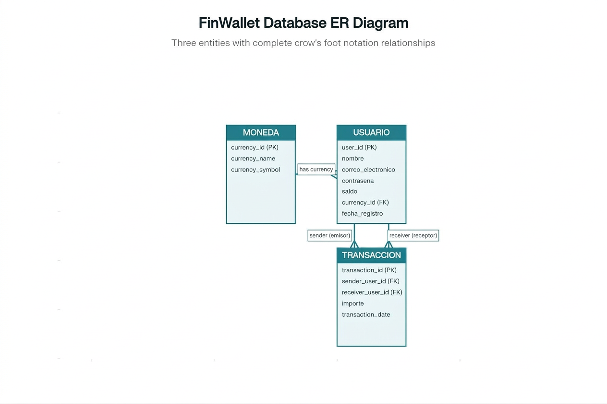

# 💳 FinWallet — Diseño de Base de Datos Relacional

Diseño e implementación completa de una base de datos relacional para un sistema de **monedero virtual**, usando MySQL. El proyecto demuestra modelado de datos, integridad referencial, transaccionalidad ACID, vistas reutilizables e indexación.

---

## 🗂️ Diagrama Entidad–Relación



**Cardinalidades:**
- `usuario` → `moneda`: N:1 — muchos usuarios pueden usar la misma moneda
- `transaccion` → `usuario` (emisor): N:1
- `transaccion` → `usuario` (receptor): N:1

---

## 🏗️ Estructura de Tablas

| Tabla | Descripción | Campos clave |
|---|---|---|
| `moneda` | Catálogo de divisas | `currency_id` PK, `currency_name`, `currency_symbol` |
| `usuario` | Cuentas del monedero | `user_id` PK, `correo_electronico` UNIQUE, `saldo` DECIMAL |
| `transaccion` | Movimientos entre usuarios | `transaction_id` PK, `sender_user_id` FK, `receiver_user_id` FK |

---

## ✨ Funcionalidades Implementadas

### DDL — Definición de estructura
- Creación de 3 tablas con tipos de datos apropiados para contexto financiero
- `DECIMAL(10,2)` para montos monetarios (evita errores de precisión de `FLOAT`)
- Claves primarias, foráneas y restricciones `UNIQUE`

### Integridad de negocio con `CHECK` constraints
```sql
-- Saldo nunca negativo
CONSTRAINT chk_saldo     CHECK (saldo >= 0)

-- Sin transferencias de monto cero
CONSTRAINT chk_importe   CHECK (importe > 0)

-- Sin auto-transferencias
CONSTRAINT chk_no_autotrans CHECK (sender_user_id != receiver_user_id)
```

### Optimización con índices
```sql
CREATE INDEX idx_trans_sender   ON transaccion(sender_user_id);
CREATE INDEX idx_trans_receiver ON transaccion(receiver_user_id);
CREATE INDEX idx_trans_fecha    ON transaccion(transaction_date);
```

### DML — Manipulación de datos
- `INSERT` de monedas, usuarios y transacciones respetando integridad referencial
- `UPDATE` con verificación antes/después
- `DELETE` con verificación de eliminación

### Transaccionalidad ACID
| Caso | Resultado |
|---|---|
| Transferencia exitosa | `COMMIT` — saldos actualizados atómicamente |
| Receptor inexistente | `ROLLBACK` — FK violation revierte todo |
| Auto-transferencia | Bloqueada por `CHECK` constraint |

### Vistas reutilizables
- `v_transacciones_detalle` — reemplaza IDs por nombres para auditoría
- `v_resumen_usuarios` — dashboard de actividad por usuario

---

## 📁 Estructura del Repositorio

```
alkewallet-database-design/
├── README.md
├── AlkeWallet_Completo.sql     # Script principal ejecutable
├── diagramas/
│   └── alke_wallet_er_diagram.png
└── documento_principal.md      # Documentación técnica detallada
```

---

## ▶️ Cómo ejecutar

**Requisitos:** MySQL 8.0+ y un cliente como DBeaver, MySQL Workbench o la terminal.

```sql
-- Opción 1: desde terminal MySQL
mysql -u root -p < AlkeWallet_Completo.sql

-- Opción 2: desde DBeaver o Workbench
-- Abrir AlkeWallet_Completo.sql y ejecutar con Ctrl+Enter
```

---
## 🐍 Interfaz CLI Python

El archivo `app.py` conecta directamente con la base de datos y permite operar el sistema desde consola sin necesidad de un cliente SQL.

```bash
# 1. Instalar dependencia
pip install -r requirements.txt

# 2. Asegurarse de haber ejecutado el script SQL primero
# mysql -u root -p < AlkeWallet_Completo.sql

# 3. Ejecutar la CLI
python app.py
```
**Operaciones disponibles desde la CLI:**
- Ver usuarios con saldo y moneda
- Ver historial completo de transacciones
- Filtrar transacciones por usuario
- Realizar transferencias con validación ACID en tiempo real
- Registrar nuevos usuarios
- Ver reporte de actividad general

## 🧠 Conceptos Aplicados

| Concepto | Implementación |
|---|---|
| DDL | `CREATE TABLE`, `DROP TABLE IF EXISTS`, `DESCRIBE` |
| DML | `INSERT`, `SELECT`, `UPDATE`, `DELETE` |
| Integridad referencial | `FOREIGN KEY` con `REFERENCES` |
| Constraints | `PRIMARY KEY`, `UNIQUE`, `NOT NULL`, `CHECK`, `DEFAULT` |
| Transaccionalidad ACID | `START TRANSACTION`, `COMMIT`, `ROLLBACK` |
| Optimización | `INDEX` en columnas de búsqueda frecuente |
| Vistas | `CREATE VIEW` para consultas reutilizables |
| Joins | `INNER JOIN`, `LEFT JOIN` en consultas analíticas |
| Agregación | `COUNT`, `SUM`, `COALESCE`, `GROUP BY` |

---

## 👤 Autor

**Javier Sandoval Tapia**  
[GitHub](https://github.com/javiersandovaltap-beep)
